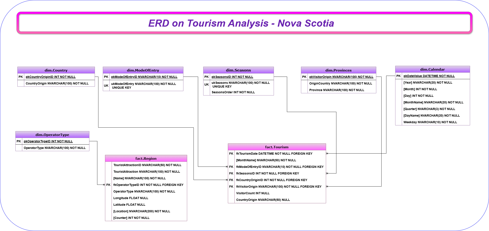

# 🌅 *Tourism-Nova Scotia* Data Mart Overview ✈️
A step-by-step process of designing, creating and loading of a Data Mart based on Tourism Analysis-Nova Scotia
Nova Scotia is a popular getaway known for its scenic beauty and calm pace of life. Being surrounded by water all around, it hosts vast greenery and picturesque locations starting from a world's famous Cabot Trails, local wineries, cozy cottages etc.

This Data mart contains the Tourist data starting from 2006 to 2024. The source for this data is [Tourism Nova Scotia Visitation](https://data.novascotia.ca/Business-and-Industry/Tourism-Nova-Scotia-Visitation/n783-4gmh/data_preview) page from [Nova Scotia Government's Open Data Portal](https://data.novascotia.ca/)

The mart is created based on the [Star Schema Design](https://www.kimballgroup.com/data-warehouse-business-intelligence-resources/kimball-techniques/dimensional-modeling-techniques/star-schema-olap-cube/) as outlined by [Ralph Kimball](https://www.kimballgroup.com/data-warehouse-business-intelligence-resources/kimball-techniques/dimensional-modeling-techniques/)

# ✔️ Steps to create Tourism-Nova Scotia Data Mart 
MS SQL Server 2022 and the below DDL and DML commands (checked ones) are used to achieve this mart.
- DDL-Data Definition Language deals with defining and managing the structure of data.

    - [x] CREATE
    - [x] ALTER
    - [x] DROP

- DML - Data Manipulation Language deals with modifying and manipulating data.

    - [x] INSERT
    - [ ] UPDATE
    - [x] DELETE

# 🗃️ DATA

## 📂 DDL
[Explanations-Instructions](./DATA/DDL/Instructions_DDL_TourismNS.ipynb)

[SQL Statements](./DATA/DDL/SQL_DDL_TourismNS.sql)

## 📂 DML
[Explanations-Instructions](./DATA/DML/Instructions_DML_TourismNS.ipynb)

[SQL Statements](./DATA/DML/SQL_DML_TourismNS.sql)

## 📂 ERD
The Entity Relationship diagram for *Tourism-Nova Scotia* Data mart is as below. Access [here]() for other formats 

